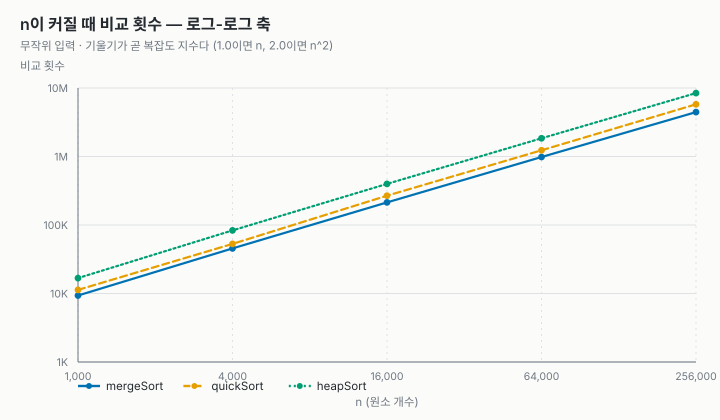
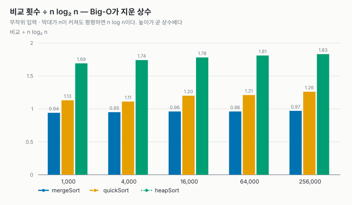
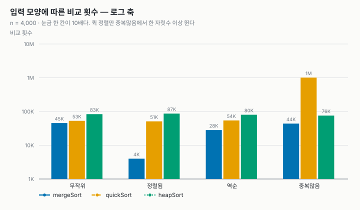
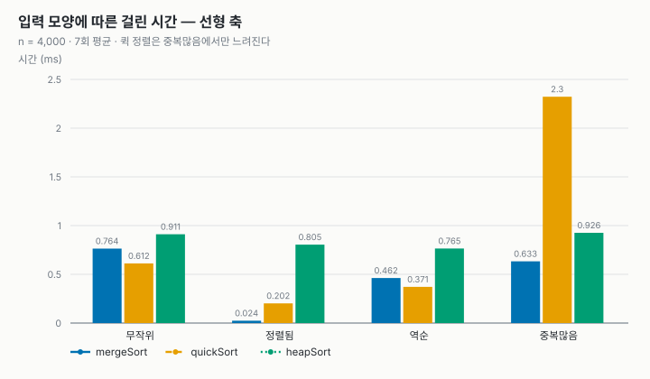
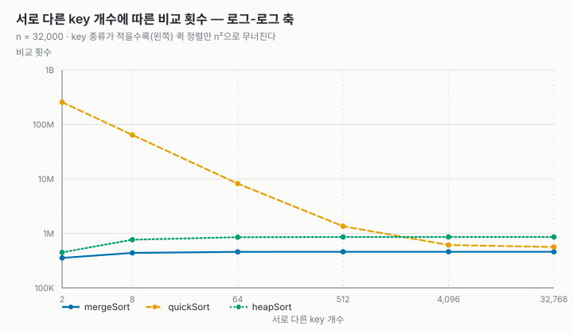
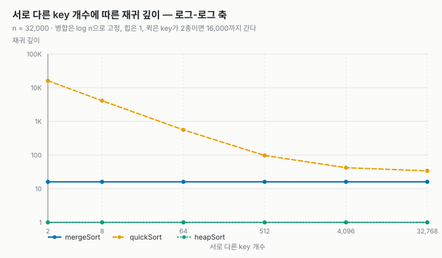

# 정렬 비교 보고서 — 병합 · 퀵 · 힙

2026-2 고급알고리즘 과제 1 · 이원호 (2026193026) · 2026-09-30

- **GitHub 저장소**: GITHUB_URL
- 실행: `make test` (유닛 테스트 45개) · `make run` (비교 표) · `make charts` (측정을 다시 돌려 그래프를 새로 그림)
- 환경: 컨테이너 안 `gcc -std=c17 -Wall -Wextra -O2`, 원소는 `(key, tag)` 8바이트

| 번호 | 정렬 | 출처 | 고른 이유 |
| --- | --- | --- | --- |
| 1 | 병합 정렬 | 수업 (주제 03) | 최악도 O(n log n)이고 안정하다. 대신 temp 배열 O(n)을 쓴다 |
| 2 | 퀵 정렬 (랜덤 피벗) | 수업 (주제 04) | 실전에서 가장 빠르다고 알려져 있다. 대신 최악 O(n²)과 불안정 |
| 3 | **힙 정렬** | **수업 밖** (Wikipedia 비교표) | 최악 O(n log n)이면서 추가 메모리 O(1). 앞의 둘이 내준 것을 둘 다 지킨다 |

셋 다 평균 O(n log n)이다. 그래서 이 보고서의 질문은 "누가 빠른가"보다 <strong>“같은 O(n log n)끼리 무엇을 얻는 대신 무엇을 내주는가”</strong>다.

---

## 1. 배우지 않은 정렬: 힙 정렬 (AI로 학습한 내용)

힙 정렬은 수업에서 다루지 않았다. Wikipedia의 [Comparison of algorithms](https://en.wikipedia.org/wiki/Sorting_algorithm#Comparison_of_algorithms) 표에서 골랐고, 어떤 정렬인지는 AI(Claude)에게 묻고 답을 확인하며 익혔다. 아래는 그 질문과 정리한 답이다.

**Wikipedia 비교표의 행**

| 정렬 | 최선 | 평균 | 최악 | 메모리 | 안정 | 방식 |
| --- | --- | --- | --- | --- | --- | --- |
| Heapsort | n log n | n log n | n log n | 1 | No | Selection |
| Merge sort | n log n | n log n | n log n | n | Yes | Merging |
| Quicksort | n log n | n log n | n² | log n | No | Partitioning |

**Q1. 힙이 뭔가?**
부모가 늘 두 자식보다 크거나 같은 **완전 이진 트리**다(최대 힙). 그래서 맨 위(루트)가 전체의 최댓값이다. 트리지만 포인터 없이 **배열에 그대로** 담는다. 인덱스 `i`의 자식은 `2i+1`, `2i+2`, 부모는 `(i-1)/2`다. 응급실 대기열처럼 "지금 가장 큰 것"을 빨리 꺼내는 데 쓰는 구조다.

**Q2. 힙으로 어떻게 정렬하나?** 두 단계다.

1. **힙 만들기**: 자식이 있는 마지막 노드(`n/2 - 1`)부터 루트까지 거꾸로 올라가며 **sift-down**(부모가 자식보다 작으면 큰 자식과 바꾸고 한 칸 내려가기를 반복)한다.
2. **꺼내기**: 루트(최댓값)를 배열 맨 끝과 바꾸고, 힙 크기를 하나 줄인 뒤, 새 루트를 sift-down한다. 이것을 `n-1`번 하면 뒤에서부터 큰 값이 차곡차곡 쌓여 오름차순이 된다.

```text
[3 1 4 1 5] → 힙 만들기 → [5 3 4 1 1]
5를 끝으로 → [1 3 4 1 | 5] → sift-down → [4 3 1 1 | 5]
4를 끝으로 → [1 3 1 | 4 5] → sift-down → [3 1 1 | 4 5]  … → [1 1 3 4 5]
```

**Q3. 왜 O(n log n)이고, 왜 최악에도 그대로인가?**
트리 높이가 약 log₂ n이라 sift-down 한 번이 O(log n)이고, 이걸 n번 하니 O(n log n)이다. 퀵 정렬과 달리 **입력 모양에 따라 나누는 비율이 바뀌는 단계가 없다.** 힙은 늘 완전 이진 트리 모양이라 높이가 입력과 무관하다. 그래서 최선·평균·최악이 모두 n log n이다. (힙 만들기 단계 자체는 O(n)이다. 아래쪽 노드가 대부분이고 그들은 조금만 내려가면 되기 때문이다.)

**Q4. 왜 추가 메모리가 O(1)인가?** 힙을 입력 배열 안에 그대로 만들고, 정렬된 부분도 같은 배열 뒤쪽에 쌓는다. 따로 쓰는 것은 교환할 때 잠시 담는 원소 한 칸뿐이다. 재귀도 필요 없어 반복문으로 쓸 수 있다.

**Q5. 왜 안정하지 않은가?** 루트와 맨 끝처럼 **멀리 떨어진 원소끼리 바꾸기** 때문이다. 같은 값 두 개의 앞뒤가 그 과정에서 쉽게 뒤집힌다.

**Q6. 그럼 왜 퀵 정렬이 더 많이 쓰이나?** 이론은 좋지만 실제로는 대개 느리다. (a) 한 층 내려갈 때 두 자식을 다 봐야 해서 **비교가 약 2n log₂ n**으로 병합(약 n log₂ n)의 두 배쯤 된다. (b) `i → 2i+1`로 **배열을 멀리 뛰어다녀 캐시를 잘 못 쓴다**(주제 01에서 이진 검색이 순차 검색보다 한 번당 비쌌던 것과 같은 이유). 그래서 C++의 `std::sort` 같은 introsort는 평소엔 퀵 정렬을 쓰다가, 재귀가 너무 깊어지면(퀵의 최악 조짐) 힙 정렬로 갈아타는 **안전망**으로 쓴다.

AI 설명을 그대로 믿지 않고 두 가지를 직접 확인했다. Q5(불안정)는 유닛 테스트의 안정성 실측으로, Q6(비교 약 2n log₂ n)은 3.2절의 측정으로 확인했다.

---

## 2. 코드 보고서

### 2.1 공통 인터페이스

교수님 샘플과 같은 방식으로, 정렬 셋을 **함수 포인터를 담은 구조체** 하나로 묶었다. 부르는 쪽(측정 · 테스트)은 정렬 이름을 적지 않고 구현 표만 훑는다. 그래서 세 정렬이 **똑같은 입력 · 똑같은 시계 · 똑같은 카운터**로 재진다.

```c
/* src/sort.c */
const SortAlgorithm SORT_ALGORITHMS[] = {
    {"mergeSort", "O(n log n)", "O(n)",     1, mergeSort},
    {"quickSort", "O(n log n)", "O(log n)", 0, quickSort},
    {"heapSort",  "O(n log n)", "O(1)",     0, heapSort},
};
```

비교는 `qsort`와 같은 규약의 함수 포인터로 받는다. 정렬이 원소 타입을 모르므로, 원소를 `(key, tag)`로 만들어 `key`로만 정렬하고 `tag`(입력 순서)로 **안정성을 실측**할 수 있다. 비교 · 이동 횟수, 추가 메모리, 재귀 깊이는 구현이 `SortStats`에 세고, 시간은 바깥(`bench.c`)에서 입력 복사를 뺀 구간만 잰다.

| 파일 | 맡은 것 |
| --- | --- |
| `src/mergeSort.c` | 병합 정렬. temp 배열을 한 번 잡아 돌려쓴다 |
| `src/quickSort.c` | 퀵 정렬. 강의의 Lomuto 파티션 + 시드 고정 랜덤 피벗 |
| `src/heapSort.c` | 힙 정렬. 반복문 sift-down, 재귀 없음 |
| `src/bench.c` · `src/main.c` | 입력 생성 · 측정 · 표/CSV 출력 (`--csv`, `--dups`, `--pivot`) |
| `tests/test_sort.c` | 유닛 테스트 45개 |
| `tools/plot.py` · `tools/svgchart.py` | CSV → SVG 그래프 (표준 모듈만) |

### 2.2 구현에서 고른 것

| 정렬 | 고른 것 | 이유 |
| --- | --- | --- |
| 병합 | 합칠 때 `<=` | 같은 값이면 왼쪽(먼저 온 것)을 먼저 꺼낸다. 이 한 글자가 안정성을 만든다 |
| 병합 | 합치기 전 `a[mid-1] <= a[mid]`이면 건너뜀 | 이미 이어 붙은 두 구간은 합칠 일이 없다. 정렬된 입력이 n-1번 비교로 끝난다 |
| 퀵 | 무작위 원소를 첫 자리로 옮긴 뒤 강의의 파티션 | 강의 옵션 1(랜덤). 정렬된 입력의 최악을 피한다 |
| 퀵 | 난수는 강의의 minstd 생성기, 시드 고정 | 같은 입력이면 같은 피벗 → 비교 횟수가 매번 똑같이 재현된다 |
| 힙 | sift-down을 재귀 대신 반복문으로 | 재귀 깊이 1, 스택까지 포함해 진짜 O(1) |

### 2.3 검증

```text
$ make test
...
45 checks, 0 failures
```

| 검사 | 내용 |
| --- | --- |
| 기본 케이스 | 섞임 · 정렬됨 · 역순 · 중복 · 모두 같은 값 · 원소 1개 · 빈 배열 |
| `qsort` 대조 | 난수 500개를 표준 라이브러리 결과와 맞춰 본다 |
| 크기 훑기 | n = 0..200 전부. 홀수 크기, 2의 거듭제곱이 아닌 크기에서 경계가 깨지기 쉽다 |
| 큰 입력 | n = 5,000에서 네 입력 모양 모두 |
| 안정성 | `tag` 순서 실측이 구현 표의 `stable` 값과 일치하는가 (병합은 안정, 퀵·힙은 불안정이어야 통과) |

---

## 3. 알고리즘 실험

### 3.1 실험 방법

| 실험 | 입력 | 크기 | 반복 |
| --- | --- | --- | --- |
| 입력 모양별 | 무작위 · 정렬됨 · 역순 · 중복많음(key 8종) | n = 4,000 | 7회 평균 |
| n을 키우며 | 무작위 | n = 1,000 ~ 256,000 | 7회 평균 |
| 중복 key | key 종류 2 ~ 32,768 | n = 32,000 | 3회 평균 |
| 피벗 (퀵만) | 네 모양, 피벗 첫 원소 / 랜덤 | n = 4,000 | 7회 평균 |

입력은 씨앗을 고정해 매번 같다. 그래서 **비교 · 이동 횟수는 언제 돌려도 같은 값**이 나오고, 시간만 기계와 부하에 따라 흔들린다. 결론은 주로 횟수로 내리고 시간은 보조로 쓴다. 표와 그래프는 한 번의 같은 실행에서 나왔고 원본은 `report/*.csv`에 있다.

### 3.2 n이 커질 때: 셋 다 O(n log n), 그러나 상수가 다르다

| n | 병합 비교 | 퀵 비교 | 힙 비교 | 병합(ms) | 퀵(ms) | 힙(ms) |
| --- | --- | --- | --- | --- | --- | --- |
| 1,000 | 9,350 | 11,293 | 16,808 | 0.20 | 0.15 | 0.22 |
| 16,000 | 214,013 | 268,188 | 397,756 | 3.89 | 3.26 | 4.61 |
| 256,000 | 4,446,613 | 5,779,281 | 8,411,329 | 92.4 | **63.5** | 98.7 |

<p> </p>

- **로그-로그에서 세 선이 나란하다.** 1,000 → 256,000 구간의 기울기는 병합 1.11, 퀵 1.12, 힙 1.12이고, 같은 구간에서 n log n의 기울기가 1.11이다. 셋 다 n log n으로 자란다는 것을 측정이 확인한다.
- **Big-O가 지운 상수를 되살리면 차이가 보인다.** 비교 횟수를 n log₂ n으로 나누면 병합은 약 0.97, 퀵은 약 1.26, 힙은 약 1.83이다. 힙이 병합의 거의 두 배인 것은 1절 Q6("한 층에 두 자식을 다 본다")에서 AI가 말한 그대로다.
- **그런데 시간은 퀵이 가장 빠르다.** 비교는 병합보다 30% 많지만 n = 256,000에서 1.46배 빠르다. 퀵은 temp로 옮겨 적었다가 되돌려 쓰는 일이 없고, 파티션이 배열을 앞에서부터 차례로 훑어 캐시를 잘 쓰기 때문으로 보인다. 힙은 비교가 가장 많은 데다 배열을 멀리 뛰어다녀 가장 느리다. 주제 01의 "**Big-O는 증가율을 말하지 시간을 말하지 않는다**"가 같은 O(n log n)끼리에서도 그대로 성립한다.

### 3.3 입력 모양별 (n = 4,000)

| 입력 | 병합 비교 | 퀵 비교 | 힙 비교 | 병합(ms) | 퀵(ms) | 힙(ms) |
| --- | --- | --- | --- | --- | --- | --- |
| 무작위 | 45,482 | 52,890 | 83,455 | 0.76 | 0.61 | 0.91 |
| 정렬됨 | **3,999** | 51,021 | 86,576 | **0.02** | 0.20 | 0.81 |
| 역순 | 28,175 | 54,314 | 80,151 | 0.46 | 0.37 | 0.77 |
| 중복많음 | 43,767 | **1,011,301** | 75,542 | 0.63 | **2.32** | 0.93 |

<p> </p>

- **병합은 정렬된 입력에서 n-1번 비교로 끝난다.** "이미 이어 붙어 있으면 건너뛴다" 검사 덕분이다.
- **힙은 입력 모양을 거의 타지 않는다.** 네 모양 모두 75,000 ~ 87,000회다. 정렬된 입력의 이득도 없지만 손해도 없다. 최악을 보장해야 하는 곳에 어울리는 성질이다.
- **퀵은 중복많음에서만 약 19배 무너진다.** 무작위일 때 52,890회가 1,011,301회가 된다. 3.4절에서 이유를 찾는다.

### 3.4 퀵 정렬의 두 가지 최악: 정렬된 입력과 중복 key

**(1) 정렬된 입력 — 랜덤 피벗이 해결한다.** 강의 그대로 첫 원소를 피벗으로 쓰면 어떻게 되는지 같은 코드에서 피벗만 바꿔 쟀다(`--pivot`).

| 입력 | 첫 원소 피벗: 비교 | 재귀 깊이 | 랜덤 피벗: 비교 | 재귀 깊이 |
| --- | --- | --- | --- | --- |
| 무작위 | 55,302 | 29 | 52,890 | 29 |
| 정렬됨 | **7,998,000** | **4,000** | 51,021 | 27 |
| 역순 | **7,998,000** | **4,000** | 54,314 | 27 |
| 중복많음 | 1,010,878 | 531 | 1,011,301 | 532 |

첫 원소 피벗은 정렬된 입력에서 정확히 n(n-1)/2 = 7,998,000번 비교한다(주제 04 16쪽의 45회 = 10·9/2와 같은 공식). 랜덤 피벗은 이를 51,021회로, **157분의 1**로 줄인다. 최악이 "특정 입력"에서 "입력과 난수의 조합"으로 바뀌었기 때문이다.

**(2) 중복 key — 랜덤 피벗으로도 해결되지 않는다.** 위 표 마지막 줄에서 랜덤이든 아니든 약 101만 회로 같다. 그래서 key 종류를 바꿔 가며 따로 쟀다(n = 32,000).

<p> </p>

| key 종류 k | 병합 비교 | 퀵 비교 | 힙 비교 | 퀵 재귀 깊이 | 퀵(ms) | 이론 n²/(2k) |
| --- | --- | --- | --- | --- | --- | --- |
| 2 | 355,490 | **256,013,572** | 447,108 | **16,117** | **471.2** | 256,000,000 |
| 8 | 438,475 | 64,114,031 | 767,740 | 4,107 | 148.7 | 64,000,000 |
| 64 | 457,873 | 8,210,237 | 851,538 | 561 | 16.9 | 8,000,000 |
| 32,768 | 459,875 | 563,085 | 859,381 | 34 | 6.3 | — |

원인은 파티션의 비교 한 줄이다. 강의의 Lomuto 파티션은 피벗보다 **작은** 것만 왼쪽으로 보내고, 피벗과 **같은** 값은 전부 오른쪽에 남긴다. 같은 값만 m개 남은 구간이 되면 매번 피벗 하나만 자리가 확정되고 나머지 m-1개가 통째로 오른쪽으로 넘어간다. 정렬된 입력의 최악과 똑같은 외길이다. 같은 값 묶음 k개가 각각 n/k개씩이면 비교는 k · (n/k)²/2 = **n²/(2k)** 이 되고, 측정값이 이 이론값과 3% 안에서 맞는다. 피벗을 무작위로 골라도 "같은 값"이라는 사실은 바뀌지 않으므로 랜덤은 소용이 없다.

key가 2종이면 퀵은 병합의 **720배** 비교하고 **100배 이상 느리며**, 재귀 깊이가 16,117까지 간다. n이 더 커지면 스택이 넘칠 위험도 있다(이번 실험 범위에서는 재지 않았다). 병합과 힙은 key 종류와 거의 무관하다. 해결책은 피벗과 같은 값을 가운데에 따로 모으는 3-way 파티션이지만, 이번 과제에서는 강의 구현을 유지하고 약점을 드러내는 데 그쳤다.

### 3.5 메모리 · 재귀 깊이 · 안정성

| 정렬 | 추가 메모리 (n = 256,000) | 재귀 깊이 (무작위 n = 256,000) | 재귀 깊이 (key 2종 n = 32,000) | 안정성 (실측) |
| --- | --- | --- | --- | --- |
| 병합 | **2,048,008 B** (temp n칸 + 1칸) | 19 | 16 | 안정 |
| 퀵 | 8 B | 44 | **16,117** | 불안정 |
| 힙 | 8 B | **1** | **1** | 불안정 |

- **병합은 메모리를 내주고 안정성과 최악 보장을 얻었다.** 원소가 8바이트여도 n = 256,000이면 2 MB를 더 쓴다. 재귀 깊이는 늘 ⌈log₂ n⌉ 언저리로 입력과 무관하다.
- **퀵은 메모리를 거의 안 쓰지만 스택을 쓴다.** 평소엔 깊이 44 정도로 O(log n)이지만, 중복이 많으면 O(n)까지 간다. 표의 "O(log n)"은 평균의 이야기다.
- **힙만 메모리 · 스택 · 최악 보장 셋을 모두 지킨다.** 대신 비교가 가장 많고 가장 느리며 불안정하다.
- **안정성은 중복 key가 있어야 드러난다.** 무작위 n = 4,000 입력에서는 퀵 · 힙도 "안정"으로 찍혔는데, `rand()` 값 4,000개에 중복이 없어 뒤집힐 같은 값이 없었기 때문이다. 중복이 생기는 n = 256,000과 중복많음 입력에서는 둘 다 "불안정"으로 찍힌다.

---

## 4. 결론: 무엇을 얻고 무엇을 내주나

| | 병합 정렬 | 퀵 정렬 (랜덤 피벗) | 힙 정렬 |
| --- | --- | --- | --- |
| 무작위 입력 속도 (n = 256,000) | 92.4 ms | **63.5 ms (가장 빠름)** | 98.7 ms |
| 비교 ÷ n log₂ n | **0.97** | 1.26 | 1.83 |
| 최악 | O(n log n) | O(n²) — 중복 key에서 실제로 발생 | O(n log n) |
| 추가 메모리 | O(n) — 2 MB | 스택 O(log n) ~ O(n) | **O(1)** |
| 안정 | **예** | 아니오 | 아니오 |
| 이럴 때 고른다 | 안정성이 필요할 때, 메모리 여유가 있을 때 | 평균 속도가 중요하고 중복이 적을 때 | 메모리가 빠듯하거나 최악을 꼭 막아야 할 때 |

셋 다 O(n log n)이지만 **최선의 정렬은 없었다.** 퀵은 가장 빠른 대신 최악과 안정성을 내줬고, 병합은 안정성과 최악 보장 대신 메모리를 내줬고, 수업 밖에서 고른 힙은 메모리와 최악을 모두 지키는 대신 속도를 내줬다. 실전 라이브러리가 퀵을 쓰다가 힙으로 갈아타는(introsort) 이유가 이 표에 있다.

### 한계

- 시간은 컨테이너 한 대에서 잰 값이라 기계 · 부하에 따라 달라진다. 결론은 재현되는 비교 · 이동 횟수로 내렸다.
- 퀵 정렬은 강의의 Lomuto 파티션을 유지했다. 3-way 파티션을 넣으면 3.4절의 중복 key 문제가 사라질 것으로 예상하지만 재지 않았다.
- 원소가 8바이트로 작다. 원소가 크면 이동 비용이 커져 이동이 많은 힙 · 병합이 더 불리해질 것이다.
- 입력은 `rand()`로 만들었다. 씨앗은 고정했지만 분포는 표준 라이브러리에 맡겼다.

### 참고

- 강의 자료 주제 01 ~ 04, 교수님 샘플 `lec-algorithm/hw1-sample-2026` (저장소 구조와 측정 방식을 참고했다. 정렬 구현 · 실험 · 분석은 새로 했다)
- Wikipedia, *Sorting algorithm — Comparison of algorithms*
- 힙 정렬 학습: AI(Claude)와의 질의응답 (1절)
